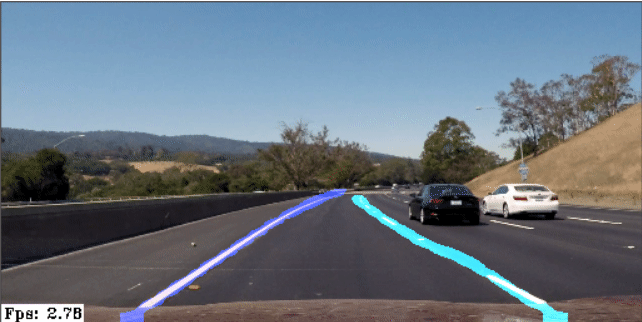

##  LaneNet on DepthAI

This example shows an implementation of [LaneNet](https://arxiv.org/pdf/1802.05591.pdf) on DepthAI in the Gen2 API system.  Model is pretrained on TuSimple dataset. It is taken from [PINTO's Model ZOO](https://github.com/PINTO0309/PINTO_model_zoo/tree/main/141_lanenet-lane-detection) and converted with model optimizer so that no additional preprocessing is need.

Input video is resized to 512 x 256 (W x H). The inference speed is around 2-4 FPS



Example video is taken from [here](https://github.com/udacity/CarND-LaneLines-P1).

### Output and postprocessing

The model produces two outputs - *(1)* binary segmentation mask where 1 represents line and *(2)* embeddings of dimension 4 for each pixel. Note that our post-processing differs from the original post-processing in [LaneNet](https://arxiv.org/pdf/1802.05591.pdf), and was made just to showcase the model on the DepthAI. 

We currently perform DBSCAN clustering of embeddings, which were sorted using Numpy's lexsort. This works OK and lanes are usually allocated to the same cluster during different frames, as long as no new line is detected on the left side of the leftmost line. For proper post-processing please refer to [LaneNet](https://arxiv.org/pdf/1802.05591.pdf) paper.

## Usage

Choose one of the following options:
```bash
# For DepthAI API
cd ./api

# For DepthAI SDK
cd ./sdk
```

### Pre-requisites

1. Download sample videos (for API version only).
   ```bash
   python3 download.py
   ```
2. Install requirements.
   ```bash
   python3 -m pip install -r requirements.txt
   ```

### Launch the script

```bash
# For DepthAI API
python3 main.py [options]

# For DepthAI SDK
python3 main.py
```

Options:

* -v, --video_path: Path to the video input for inference. Default: *vids/vid3.mp4*.
* -nn, --nn_model: Select model path for inference. Default: *models/lanenet_openvino_2021.4_6shave.blob*
